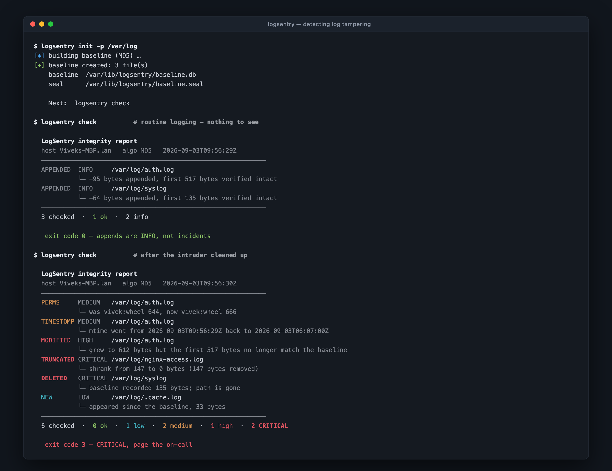
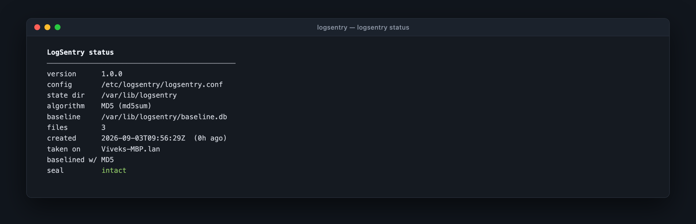
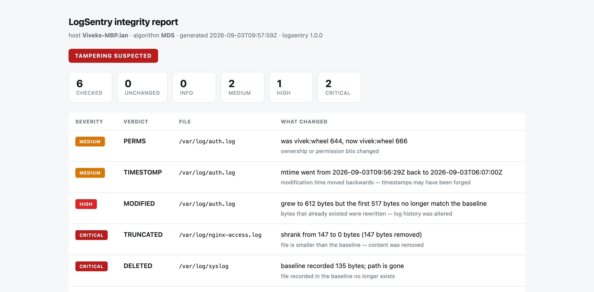
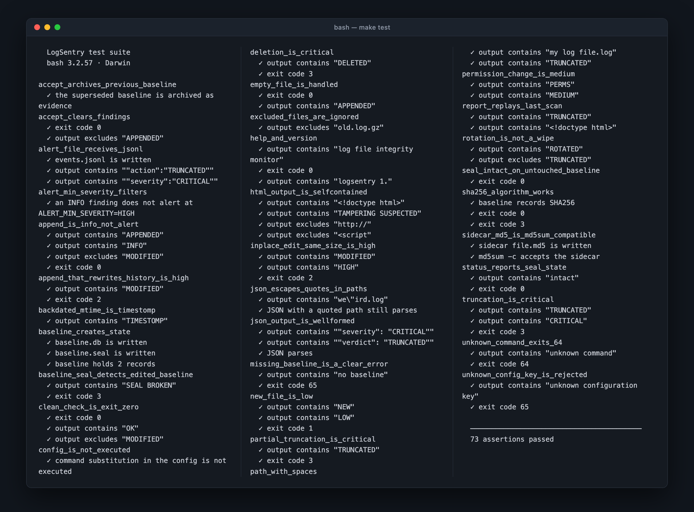

<h1 align="center">LogSentry</h1>

<p align="center">
  <strong>Log File Integrity Monitor</strong><br>
  Detects tampering with log files — rewrites, truncation, deletion and timestamp forgery —<br>
  using nothing but Bash and the utilities already on the box.
</p>

<p align="center">
  
  
  
  
  
</p>

<p align="center">
  
</p>

---

## The problem this solves

When someone breaks into a Linux host, editing `/var/log/auth.log` is not an
afterthought — it is step one of covering their tracks. They delete the lines
that show the failed brute-force, the successful root login, and the commands
they ran. Sometimes they truncate the whole file. Sometimes they are careful
and swap the incriminating line for an innocent one of exactly the same length.

You cannot tell any of this happened by reading the log, because you are
reading the version the attacker left for you.

**The standard answer is to hash the files and compare.** And it works — right
up until you try it on an actual log file, which grows every few seconds. A
plain `md5sum` comparison alerts on every single append, so within a day
everyone has muted the channel and the tool has become decorative.

## The idea

LogSentry asks a sharper question than *"did the digest change?"*

> Given that the file was **S bytes** long and hashed to **H** at baseline time,
> does the first **S bytes** of the file *today* still hash to **H**?

If yes, everything that was already written is still byte-for-byte intact and
the file was only appended to — which is exactly what a healthy log file does.
No alert.

If no, something rewrote history. That is not a thing well-behaved daemons do.

```
   baseline:   [ 517 bytes, md5 = 4f3a…9c ]

   append      [ 517 bytes, md5 = 4f3a…9c ][ 95 new bytes ]   → prefix matches   → INFO
   rewrite     [ 517 bytes, md5 = b81e…07 ][ 95 new bytes ]   → prefix differs   → HIGH
   truncate    [ 190 bytes                ]                   → file shrank      → CRITICAL
```

That one distinction is what makes the difference between a tool you deploy and
a tool you mute.

## Quick start

No installation required — it runs straight from a clone.

```bash
git clone https://github.com/Dc0der-X/Log-File-Integrity-Monitor.git
cd Log-File-Integrity-Monitor
```

Watch it catch a simulated intrusion, in a sandbox, in about thirty seconds:

```bash
./demo/demo.sh
```

Then point it at something real:

```bash
sudo ./bin/logsentry init  -p /var/log/auth.log -p /var/log/syslog
sudo ./bin/logsentry check
```

`init` records the baseline. `check` compares against it. That is the whole
mental model.

## What it detects

| Verdict | Severity | What actually happened | Exit |
|---|---|---|---|
| `APPENDED` | INFO | New lines added, earlier bytes verified intact — normal logging | 0 |
| `ROTATED` | INFO | New inode with an archived copy alongside — logrotate did its job | 0 |
| `NEW` | LOW | A file appeared in a monitored directory since the baseline | 1 |
| `PERMS` | MEDIUM | Mode, owner or group changed | 1 |
| `TIMESTOMP` | MEDIUM | `mtime` moved **backwards** — timestamps were forged | 1 |
| `MODIFIED` | **HIGH** | Bytes that already existed were rewritten — log history was altered | 2 |
| `UNREADABLE` | **HIGH** | The file exists but can no longer be read | 2 |
| `TRUNCATED` | **CRITICAL** | The file shrank — a partial or total log wipe | 3 |
| `DELETED` | **CRITICAL** | A baselined file is gone | 3 |
| `SEAL` | **CRITICAL** | The **baseline itself** was edited after it was sealed | 3 |

The exit code is the highest severity found, so cron, systemd and monitoring
agents can act on the result without parsing a single line of output.

The reasoning behind each verdict — including the two cases most tools get
wrong, log rotation and same-size rewrites — is written up in
**[docs/DETECTION-LOGIC.md](docs/DETECTION-LOGIC.md)**.

## Commands

```
logsentry init      Create a baseline of the monitored files
logsentry check     Compare the live files against the baseline
logsentry watch     Run check on a loop, alerting on every deviation
logsentry status    Show baseline age, file count and seal state
logsentry verify    Verify the baseline's own seal, nothing else
logsentry accept    Re-baseline after reviewing legitimate changes
logsentry report    Re-render the last scan as HTML or JSON
```

<p align="center">
  
</p>

Every flag is documented in **[docs/USAGE.md](docs/USAGE.md)**, and
`logsentry help` prints the same reference offline.

## Output formats

**Text** for humans, **JSON** for your SIEM, **HTML** for the incident ticket.

```bash
logsentry check --format json                        # ECS-shaped, one object per scan
logsentry check --format html -o /tmp/incident.html  # self-contained report
```

The HTML report has no external CSS, no web fonts and no JavaScript, so it
opens on an air-gapped forensics laptop:

<p align="center">
  
</p>

## Alerting

Five sinks, all built on utilities the OS already ships:

| Sink | Mechanism | Configure with |
|---|---|---|
| Console | stderr, colour-coded | `ALERT_CONSOLE=1` |
| File | append-only JSONL, ECS field names | `ALERT_FILE=/var/log/logsentry/events.jsonl` |
| Syslog | `logger(1)`, facility `auth`, severity-mapped | `ALERT_SYSLOG=1` |
| Webhook | `curl(1)`, Slack- and Teams-compatible | `ALERT_WEBHOOK_URL=…` |
| Email | `mail(1)` | `ALERT_EMAIL=soc@example.com` |

File and syslog fire once per finding so nothing is lost. Webhook and email
fire **once per scan** with a digest — paging someone forty times for one
logrotate run is how an alert channel gets muted forever.

`ALERT_MIN_SEVERITY=LOW` is the production default: it stays quiet for routine
appends and rotations, and speaks up for everything else.

## Installation

```bash
sudo ./install/install.sh --with-timer
```

This installs the binary and libraries under `/usr/local`, writes a config to
`/etc/logsentry/logsentry.conf`, creates a `0700` state directory at
`/var/lib/logsentry`, and registers a scheduler — it detects systemd, launchd
or plain cron and picks the right one. A hardened `logsentry.service` (with
`ProtectSystem=strict`, `SystemCallFilter=@system-service` and a
`SuccessExitStatus` that understands the exit-code scheme) ships alongside.

`sudo ./install/install.sh --uninstall` removes it again, deliberately keeping
your config and baselines — the baseline is evidence, and it is not the
uninstaller's place to destroy it.

Or use the Makefile:

```bash
make install PREFIX=/usr/local
make help                          # every target
```

## Configuration

Copy `config/logsentry.conf.example` and edit it. Every key is commented with
the reasoning, not just the syntax.

```bash
WATCH_PATHS="/var/log/auth.log /var/log/syslog /var/log/nginx/*.log"
EXCLUDE_PATTERNS="*.gz *.bz2 *.xz"
STATE_DIR=/var/lib/logsentry
HASH_ALGO=md5                      # or sha256
ALERT_MIN_SEVERITY=LOW
ALERT_SYSLOG=1
CHECK_INTERVAL=60
```

The config file is **parsed, never sourced**. Sourcing it would let anyone who
can write to `logsentry.conf` execute arbitrary code as the root user running
the monitor — which is precisely the privilege an attacker tampering with logs
is trying to obtain. Unknown keys are a hard error, so a typo fails at start-up
instead of silently monitoring nothing. There is a test for this
(`config_is_not_executed`).

## Why MD5

MD5 is broken for **collision resistance**: an adversary can construct two
different files that share a digest. It is *not* broken for the property this
tool depends on, which is **second-preimage resistance** — given a log file
that already exists, producing different content with the same MD5 is not
practical.

MD5 is the default because it is roughly twice as fast on large files and is
available everywhere. `HASH_ALGO=sha256` is one line away when a compliance
regime asks for it (PCI DSS 11.5, FIPS environments). Both are covered by the
test suite.

## The baseline is the root of trust

An attacker who rewrites `/var/log/auth.log` will also try to rewrite the
baseline, so that the next check comes back clean. LogSentry seals the baseline
with a digest stored separately, and `logsentry verify` checks that seal before
anything else — a broken seal is reported as CRITICAL and every "clean" result
below it is marked unreliable.

Set `BASELINE_SEAL_KEY` and the seal becomes an HMAC-SHA256 the attacker cannot
recompute without the key. **The key is only meaningful if it does not live on
the host being monitored:**

```bash
BASELINE_SEAL_KEY=$(cat /mnt/usb/logsentry.key) logsentry check
```

The full threat model — including what LogSentry deliberately does *not*
protect against — is in **[docs/ARCHITECTURE.md](docs/ARCHITECTURE.md)**.

## Tests

```bash
make test          # 73 assertions, no test framework to install
make syntax        # parse every script
make lint          # shellcheck (if installed)
```

<p align="center">
  
</p>

The suite covers each verdict, both hash algorithms, paths containing spaces
and quotes, empty files, log rotation, alert-severity filtering, JSON
well-formedness, `md5sum -c` compatibility of the sidecar files, and the
config-injection guard. CI runs it on **Ubuntu and macOS** — GNU coreutils and
BSD userland disagree on nearly every flag this tool needs, so the portability
claim is tested rather than asserted.

## Project layout

```
bin/logsentry              CLI entry point — argument parsing and commands
lib/common.sh              Portability shims, logging, safe config parsing
lib/baseline.sh            Baseline read/write and sealing
lib/detect.sh              The classification engine
lib/alert.sh               Alert dispatch to five sinks
lib/report.sh              Text, JSON and HTML renderers
config/                    Annotated example configuration
install/                   Installer, systemd units, launchd plist
demo/demo.sh               Sandboxed attack walkthrough
tests/run_tests.sh         Test suite (pure Bash, no framework)
tools/ansi2html.py         Docs tool — regenerates the screenshots
docs/                      Architecture, detection logic, usage, IR runbook
```

## Documentation

| Document | What it covers |
|---|---|
| **[DETECTION-LOGIC.md](docs/DETECTION-LOGIC.md)** | The decision table, the prefix-hash proof, and why rotation and same-size rewrites break naive tools |
| **[ARCHITECTURE.md](docs/ARCHITECTURE.md)** | Data flow, the baseline format, the threat model, and the design decisions with their trade-offs |
| **[USAGE.md](docs/USAGE.md)** | Every command and flag, deployment recipes, and troubleshooting |
| **[INCIDENT-RESPONSE.md](docs/INCIDENT-RESPONSE.md)** | What to actually do when the tool fires — a runbook, per verdict |

## Limitations

Stated plainly, because a security tool that oversells itself is worse than no
tool at all:

- **It is a polling monitor.** An attacker who edits a log and is gone within
  the check interval is still caught (the evidence is in the file), but nothing
  is *prevented*. This detects tampering; it does not stop it.
- **A root attacker can stop the monitor.** Nothing running on a box can
  survive full control of that box. The mitigations are shipping the JSONL
  events off-host immediately and keeping the seal key elsewhere.
- **It cannot detect what was never written.** If an intruder disables
  `rsyslog` before acting, there is no log entry to tamper with. Pair this with
  monitoring that the logging daemon is alive.
- **A baseline taken after a compromise is worthless** — it records the
  attacker's version of events as normal. Baseline hosts you have reason to
  believe are clean.

## Roadmap

- [ ] Append-only remote baseline storage (S3 Object Lock, WORM)
- [ ] `--since` to diff two archived baselines directly
- [ ] Optional `inotify` fast path on Linux, with polling retained as the
      fallback (see ARCHITECTURE.md for why polling is the default)
- [ ] Prometheus textfile-collector output

## Contributing

Bug reports and pull requests are welcome — see
[CONTRIBUTING.md](CONTRIBUTING.md). The one hard rule: **no runtime
dependencies.** If it needs something that is not already on a stock Linux or
BSD box, it does not belong in `bin/` or `lib/`.

## License

MIT — see [LICENSE](LICENSE).
